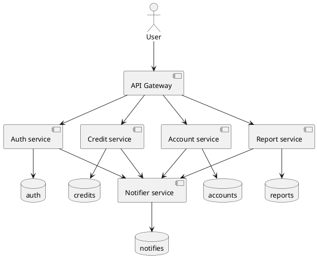

# API Gateway Service

API Gateway Service — это микросервис, реализованный с использованием HTTP, который служит шлюзом для маршрутизации и управления API запросами к внутренним сервисам.

Визуализация API Gateway и внутренних сервисов




## Содержание

- [Функциональность](#функциональность)
- [Технологии](#технологии)
- [Установка](#установка)
- [Запуск](#запуск)
- [Использование](#использование)
- [Тестирование](#тестирование)

## Функциональность

- Регистрация и аутентификация пользователей через `auth-service`.
- Обеспечение безопасного взаимодействия между клиентом и внутренними сервисами.
- Проверка jwt токенов.
- Интеграция с внутренними микросервисами.

## Технологии

- Go 1.23+
- HTTP REST
- net/http — для маршрутизации HTTP-запросов
- [swagger](https://github.com/swaggo/swag) — для автогенерации Swagger-документации
- Docker (для контейнеризации)

# Установка

1. **Клонируйте репозиторий:**

    ```bash
    git clone git@github.com:patyukin/mbs-api-gateway.git
    cd mbs-api-gateway
    cp config-example.yaml config.yaml
    ```

2.	**Установите необходимые зависимости:**

    ```bash
    make tidy
    ```

# Запуск

Запуск с Docker:

```bash
make up
```

# Использование

API Gateway предоставляет REST API-интерфейсы для взаимодействия с внутренними сервисами.
Примеры HTTP запросов:
- Регистрация пользователя:
```bash
curl -X POST http://localhost:5000/v1/sign-up \
  -H "Content-Type: application/json" \
  -d '{
    "email": "john.doe@example.com",
    "password": "securepassword123",
    "telegram_login": "johndoe_telegram",
    "first_name": "John",
    "last_name": "Doe",
    "patronymic": "Jonathan",
    "date_of_birth": "1990-01-01",
    "phone": "79000000000",
    "address": "Moscow, Russia, 1, 1, 1"
  }' 
```

# Тестирование

1. Запуск go тестов

   ```bash
   make test
   ```

2. В папке `tests` запускать тесты HTTP запросов
